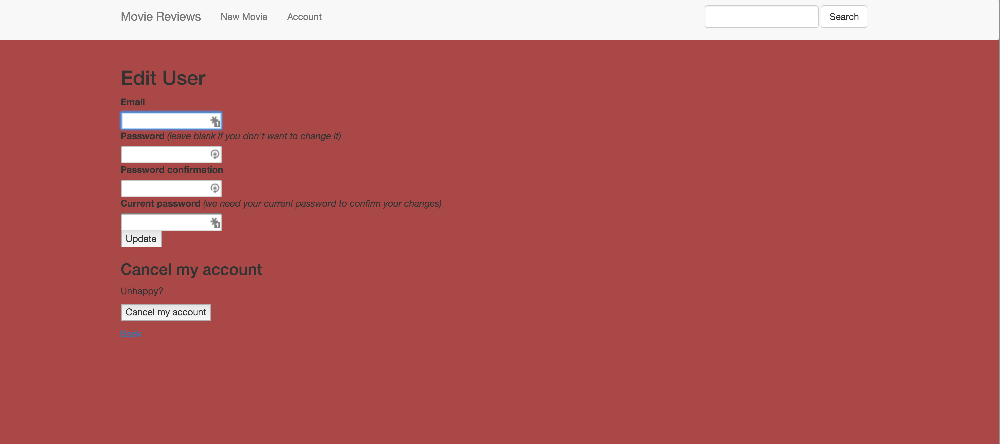

# movieReview

**movieReview** is a movies app using Ruby on Rails.

Time spent: **7** hours spent in total

## User Stories

The following **required** functionality is complete:

- [X] User can upload movies.
- [X] User can login to the system.
- [X] User can create an account.
- [X] User can write reviews for movie.

## Image Screenshot 

Here's a Screenshot of implemented user stories:

  

GIF created with [LiceCap](http://www.cockos.com/licecap/).

## Notes

Follow the tutorail on [YouTube](https://www.youtube.com/watch?v=0DR5JLZ2Qgg&list=PL23ZvcdS3XPLNdRYB_QyomQsShx59tpc-&index=5).
